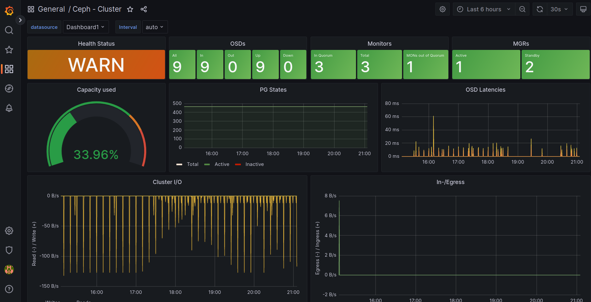

# Monitoring

Monitoring Cephu se skládá z interní web služby ``Ceph Dashboard`` a volitelně externích služeb ``Prometheus`` a ``Grafana``.

## Architektura

``Ceph Dashboard`` je modulem daemon ``ceph-mgr``. ``Ceph Dashboard`` umožňuje vizuální inspekci a správu jednotlivých služeb a zdrojů v Ceph clusteru pomocí webového přístupu, je tak užitečným doplňkem terminálových cli. ``Ceph Dashboard`` dále podporuje integraci externích nástrojů ``Prometheus`` a ``Grafana`` pro pokročilé ukládání a vizualizaci výkonových statistik. Ceph umožňuje automatickou instalaci ``Prometheus`` a ``Grafana`` do kontejnerů při použití ``cephadm`` orchestrátoru, případně ``Rook`` v ``Kubernetes``. Pro naše účely předpokládáme manuální integraci těchto nástrojů, komponenty monitoringu nechceme primárně instalovat spolu s provozními komponenty hyperkonvergovaného cephu, tak aby byla zajištěna důsledná izolace. Instalace monitorovacích komponent je tak provedena na odděleném virtuálním serveru, na kterém tyto nástroje umístíme a taktéž připravíme architekturu pro centralizovaný monitoring, který takto může monitorovat libovolné množství nezávislých clusterů. Pro základní monitoring postačí virtuální server s 4GB RAM a 4VCPU, s 16GB místa na disku pro časovou retenci statistik

## Instalace Ceph Dashboard

``Ceph Dashboard`` je modulem daemonu ``ceph-mgr``. Pro spuštění modulu je třeba na všech serverech kde ``ceph-mgr`` doinstalovat balíkové závislosti ``Ceph Dashboard``

#. Instalace balíku  ``ceph-mgr-dashboard``

    sudo apt-get install ceph-mgr-dashboard

## Konfigurace ``Ceph Dashboard``

``Ceph Dashboard`` podporuje instalaci SSL. Pro naše použití předpokládáme externí SSL terminaci, tak abychom nebyli nuceni využívat self signed certifikáty, SSL autentifikaci tak můžeme vypnout

#. Vypnutí SSL autentifikace

    ceph config set mgr mgr/dashboard/ssl false

``Ceph Dashboard`` podporuje autentifikaci, a pro základní přístup je třeba vytvořit uživatele. Využijeme předvytvořené role, které ``Ceph Dashboard`` používá. Heslo umístíme do souboru ``dashboard.pwd``

#. Vytvoření hesla a přístupu pro uživatele admin

    ceph dashboard ac-user-create admin -i dashboard.pwd administrator

Nyní je ``Ceph Dashboard`` připravena k provozu, je možné povolit modul dashboard v ``ceph-mgr`` daemonu

#. Povolení ``Ceph Dashboard`` v daemonu ``ceph-mgr``

    ceph mgr module enable dashboard

#. Ověření, že ``Ceph Dashboard`` běží a poslouchá na HTTP portu

    netstat -lpn | grep 8080

    tcp6       0      0 :::8080                 :::*                    LISTEN      3562877/ceph-mgr 

``Ceph Dashboard`` je v provozu, a můžeme se přihlásit v prohlížeči a začít ``Ceph Dashboard`` používat

#. Otevření URL ``Ceph Dashboard`` v prohlížeči

    http://172.27.175.23:8080

Při změně provozních parametrů ``Ceph Dashboard`` je vždy nutné provést restart modulu pomocí disable/enable, tak aby se nové parametry aplikovaly

#. Restart modulu ``Ceph Dashboard``

    ceph mgr module disable dashboard
    ceph mgr module enable dashboard

## Instalace Prometheus

Monitorovací software ``Prometheus`` je ideální instalovat na oddělený virtuální server, který bude mít přístup na IP serverů v Ceph clusteru a provádět vzdálený sběr dat a monitoring. Pro instalaci se předpokládají distribuční balíky systému Debian/Ubuntu, a to konkrétně Ubuntu 22.04 LTS Jammy, který obsahuje již moderní verzi systému ``Prometheus`` 2.31, není tak nutné provádět manuální instalaci ze zdrojů.

#. Instalace balíku ``prometheus``

    sudo apt-get install prometheus

#. Ověření, že ``Prometheus`` běží a poslouchá na HTTP portu

    netstat -lpn | grep prometheus

    tcp6       0      0 :::9090                 :::*                    LISTEN      10649/prometheus

``Prometheus`` je nainstalován. Nyní je možné navštívit webový UI

#. Otevření URL ``Prometheus`` v prohlížeči

    http://172.27.175.112:9090

##. Konfigurace ``Prometheus``

Aby bylo možné zahájit sběr dat z Cephu, je nutné na všech ceph nodech, kde běží ``ceph-mgr``, povolit sběr dat z ``prometheus`` modulu

#. Povolení modulu ``prometheus`` na všech nodech, kde běží ``ceph-mgr``

    ceph mgr module enable prometheus

Daemon ``ceph-mgr`` automaticky pustí ``prometheus`` modul a exporter na portu 9283

#. Oveření ``Prometheus`` exporteru na všech nodech s ``ceph-mgr``

    netstat -lpn | grep 9283

    tcp6       0      0 :::9283                 :::*                    LISTEN      3562877/ceph-mgr

Pro kompletní sběr všech informací je dále nutné na všechny ostatní Ceph servery nainstalovat i ``prometheus-node-exporter``, který zajistí sběr systémových dat jako vytížení CPU či disků, které dále využijeme při analýze výkonu v grafech a které využívají i oficiální grafana šablony

#. Instalace  ``prometheus-node-exporter`` na všech serverech s komponenty Ceph

    sudo apt-get install prometheus-node-exporter

Nyní je Ceph cluster připraven na sběr dat a je možné nakonfigurovat Prometheus, aby tyto data sbíral. Konfiguraci provedeme přidáním setů pro modul ceph pomocí sekce scrape_cofigs v /etc/prometheus/prometheus.yaml. Je vhodné, aby fungovalo DNS a mohli jsme používat buď FQDN a nebo hostname, tak aby byla potom data v dashboardech čitelná. Konfigurační soubor můžeme též plnit pomocí service discovery a konfiguračního managementu pomocí tagů automaticky. 

#. Přidání serverů s ``ceph-mgr`` a modulem prometheus do ``/etc/prometheus/prometheus.yaml``

    scrape_configs:

        - job_name: ceph
        # ceph-mgr module
            static_configs:
            - targets: ['ceph1:9283','ceph2:9283','ceph3:9283']

Rovněž přidáme novou sekci pro sběr systémových dat z ``prometheus-node-exporter`` ze všech serverů s Ceph

#. Přidání všech serverů v Ceph s ``prometheus-node-exporter`` pro sběr systémových statistik

    scrape_configs:

        - job_name: ceph-node-exporter
        # ceph s prometheus-node-exporter
            static_configs:
            - targets: ['ceph1:9100','ceph2:9100','ceph3:9100']

Po přidání všech serverů pro sběr dat je nutné provést restart ``prometheus``

#. Restart daemonu ``prometheus``

    systemctl restart prometheus

Prometheus nyní sbírá všechna potřebná data. Provedeme kontrolu přes dashboard v záložce ``Status/Targets``, že se data načítají

Sběr dat z Ceph clusteru je plnně funkční, nyní je třeba nainstalovat ``Grafanu`` pro vizualizaci dat

## Instalace Grafany

Grafovací software ``Grafana`` doporučujeme instalovat na stejný oddělený virtuální server jako Prometheus, je komplementem monitorovacího řešení pro Ceph. Pro instalaci Grafany využijeme repozitáře vývojářů, aktualizace jsou zde rapidní a otevřeme si tak cestu k bezproblémovému update.

#. Instalace repository a Grafany

    sudo apt-get install -y apt-transport-https software-properties-common wget
    sudo wget -q -O /usr/share/keyrings/grafana.key https://apt.grafana.com/gpg.key
    echo "deb [signed-by=/usr/share/keyrings/grafana.key] https://apt.grafana.com stable main" | sudo tee -a /etc/apt/sources.list.d/grafana.list
    sudo apt-get update
    sudo apt-get install grafana

Balík Grafana z neznámého důvodu nespouští ``grafana-server`` automaticky, je třeba výslovně vynutit

#. Automatický start Grafany po spuštění a okamžitý start

    sudo systemctl daemon-reload
    sudo systemctl enable grafana-server
    sudo systemctl start grafana-server

Pro správnou funkci všech předdefinovaných dashboardů je třeba nainstalovat ``Grafana pluginy``

#. Instalace Grafana pluginů ``vonage-status-panel`` a ``grafana-piechart-panel``

    grafana-cli plugins install vonage-status-panel
    grafana-cli plugins install grafana-piechart-panel

## Konfigurace Grafany

Pro přístup z Ceph Dashboard je třeba dále povolit volby pro anonymní přístup a embedding Grafany v ``/etc/grafana/grafana.ini``

#. Povolení anonymního přístupu v ``/etc/grafana/grafana.ini``

    [auth.anonymous]
    enabled = true
    org_name = Main Org.
    org_role = Viewer

#. Povolení embedded Grafany v ``/etc/grafana/grafana.ini``

    [security]
    allow_embedding = true

Po dokončení konfiguračních změn je třeba provést restart ``grafana-server``

#. Restart daemonu ``grafana-server``

    systemctl restart grafana-server

Po dokončení konfigurace ``Grafana`` běží na portu 3000

#. Oveření funkce daemonu Grafany na portu 3000

    netstat -lpn | grep grafana

    tcp6       0      0 :::3000                 :::*                    LISTEN      11735/grafana

``Grafana`` je nainstalována a nakonfigurována. Nyní je možné navštívit webový UI

#. Otevření URL Grafany v prohlížeči

    http://172.27.175.112:3000

Nyní je třeba přidat datový zdroj Prometheus, aby ``Grafana`` mohla vizualizovat data. Datový zdroj přidáme v ``Settings/Data Sources``, typ je ``Prometheus`` a adresa je lokální adresa Prometheus serveru http://172.27.175.112:9090. Datový zdroj je nutné pojmenovat ``Dashboard1``, aby byla zachována kompatibita s ``Ceph Dashboard``

 #. Přidání datového zdroje Prometheus na adrese http://172.27.175.112:9090 s názvem Dashboard1

 

``Grafana`` je připravena zobrazit vizualizaci dat z Cephu. Pro základní vizualizaci dat použijeme předpřipravené dashboardy od vývojářů Cephu, které se zobrazují z Ceph Dashboard. Zdrojové soubory dashboardů je možné stáhout z git repozitářů Cephu

#. Stažení ``Grafana`` dashboardů z git repozitářů Cephu

    https://github.com/ceph/ceph/tree/main/monitoring/ceph-mixin/dashboards_out

Jednotlivé JSON soubory je nutné importovat lokálně z browseru přes dashboard přes záložku ``Dashboards/Import``. Po dokončení importu budou dashboards dostupné v hlavním seznamu Dashboards

#. Zobrazení seznamu importovaných dashboards

 

Po dokončení importu všech souborů je možné zobrazit veškeré dostupné grafy z diagnostiky ``Cephu``

#. Zobrazení informací z dashboardu ``Ceph - Cluster``

Instalace ``Grafany`` a vizualizace Ceph clusteru je nyní kompletní.

## Alerty

Pro provoz Ceph clusteru je nutné sledovat aktuální stav a kritické hodnoty, a při jejich překročení upozornit administrátora, aby vzniklý problém řešil. Alerty je možné nastavit v systému ``Prometheus``, případně využít ``Zabbix`` modul

## Zabbix modul

Zabbix modul je součástí ``ceph-mgr`` daemonu a slouží k odesílání notifikací na zabbix server

### Instalace Zabbix modulu

Pro základní funkci ``ceph-mgr`` modulu ``zabbix`` je nutné na všech serverech s ceph-mgr nainstalovat balík ``zabbix-agent``

#. Instalace balíku ``zabbix-agent``

    sudo apt-get install zabbix-agent

### Konfigurace Zabbix modulu

#. Spuštění Zabbix modulu

    ceph mgr module enable zabbix

#. Parametry Zabbix modulu

* zabbix_host (nutné nastavit)
* identifier (default ceph-fsid)
* zabbix_port (default 10051)
* zabbix_sender (default /usr/bin/zabbix_sender)
* interval (default 60)
* discovery_interval (default 100)

#. Nastavení parametrů Zabbix modulu

    ceph zabbix config-set zabbix_host zabbix.mydomain.com
    ceph zabbix config-set identifier ceph1.mydomain.com

#. Zobrazení konfigurace Zabbix modulu

    ceph zabbix config-show

#. Okamžité odeslání dat mimo interval

    ceph zabbix send

### Debug Zabbix modulu

Pro debugging ``zabbix`` modulu je nutné nastavit nejvyšší logovací úroveň pro ceph-mgr v konfiguračním souboru ``/etc/ceph/ceph.conf`` a provést jeho restart, zabbix modul bude potom zapisovat veškeré akce do logu

#. Nastavení logování ceph-mgr v ``/etc/ceph/ceph.conf``

    [mgr]
        debug mgr = 20

## Co sledovat monitoringem

### Ceph health

Zdraví clusteru je nejběžnější metrikou, kterou je třeba sledovat. Všeobecně platí že cluster by měl vždy být v statusu ``HEALTH_OK``

    ceph -s

        cluster:
        id:     c27847a7-f614-4bfc-a416-4349da39c264
        health: HEALTH_OK

Hodnoty health ``HEALTH_WARN`` a ``HEALTH_CRITICAL`` vyžadují zásah administrátora

### Latence OSD

Latence OSD je kritickým ukazatelem výkonu. Je součástí základního Ceph dashboardu a všeobecně platí, že u NVME disků by neměla přesáhnout násobky desítek ms. Latence ve stovkách ms značí problémový či přetížený disk a může negativně ovlivnit výkon například virtálních serverů, které zde mají své systémové disky. Latence nad 1000ms už je naprosto kritická a vede k selhání serverů.

#. Ukázka typické latence správně fungujícího NVME Cephu v Dashboardu ``Ceph Detail / OSD State``

#. Výpis aktuální latence OSD

    ceph osd perf

    osd  commit_latency(ms)  apply_latency(ms)
    10                 6                  6
    9                   9                  9
    8                   8                  8
    7                   7                  7
    6                   2                  2
    5                   4                  4
    4                   8                  8
    3                  13                 13
    2                   3                  3
    1                   4                  4
    0                   2                  2

### Dostupné místo na Cephu

Pro správnou funkci Cephu a bezpečný provoz je třeba dodržovat maximální obsazení Cephu tak, aby i při selhání jednoho celého serveru, případně failure zóny v CRUSH mapě bylo možné cluster obnovit do stavu, kdy je stále možné dosáhnout vysoké dostupnosti. Pokud máme 4 servery s OSD a stejným počtem disků, mělo by být vždy volné minimálně 1/4 kapacity plus 10% celkové kapacity. Při selhání jednotlivého serveru tak bude možné všechny data pomocí recovery automaticky přenést na servery zbývající a stále bude dostupné 10% volného místa pro další bezpečný provoz, než bude vráceno selhané hardware do provozu. Dále platí, že při typickém provozu by se nemělo dlouhodobě přesahovat 90% volného místa na jednotlivých OSD. Při překročení více jak 97% místa se cluster přepne do read-only stavu a je možné řešit pouze rozšířením místa, toto je situace do které se nechceme v žádném případě dostat

#. Zobrazení statistik místa na jednotlivých OSD

    ceph osd df

    ID   CLASS  WEIGHT   REWEIGHT  SIZE     RAW USE  DATA     OMAP     META     AVAIL    %USE   VAR   PGS  STATUS
    0    ssd  0.38519   1.00000  394 GiB  215 GiB  187 GiB  379 MiB   27 GiB  180 GiB  54.39  1.03  177      up
    1    ssd  0.38519   1.00000  394 GiB  210 GiB  183 GiB  368 MiB   26 GiB  185 GiB  53.15  1.01  173      up
    2    ssd  0.38519   1.00000  394 GiB  211 GiB  188 GiB  397 MiB   15 GiB  184 GiB  53.43  1.01  177      up
    3    ssd  0.38519   1.00000  394 GiB  208 GiB  183 GiB  396 MiB  6.7 GiB  186 GiB  52.77  1.00  173      up
    4    ssd  0.38519   1.00000  394 GiB  206 GiB  181 GiB  391 MiB  3.7 GiB  189 GiB  52.13  0.99  171      up
    5    ssd  0.38519   1.00000  394 GiB  210 GiB  183 GiB  366 MiB   27 GiB  184 GiB  53.30  1.01  173      up
    6    ssd  0.38519   1.00000  394 GiB  206 GiB  181 GiB  351 MiB   24 GiB  188 GiB  52.22  0.99  171      up
    7    ssd  0.38519   1.00000  394 GiB  210 GiB  187 GiB  360 MiB   17 GiB  185 GiB  53.14  1.01  177      up
    8    ssd  0.38519   1.00000  394 GiB  211 GiB  184 GiB  349 MiB   26 GiB  183 GiB  53.49  1.02  174      up
    9    ssd  0.38519   1.00000  394 GiB  212 GiB  184 GiB  363 MiB   18 GiB  183 GiB  53.71  1.02  175      up
    10    ssd  0.38519   1.00000  394 GiB  207 GiB  184 GiB  364 MiB  9.9 GiB  188 GiB  52.36  0.99  173      up

#. Zobrazení celkového obsazení clusteru

    ceph -s

    data:
    pools:   3 pools, 16641 pgs
    objects: 19.39M objects, 18 TiB
    usage:   39 TiB used, 35 TiB / 74 TiB avail
    pgs:     16641 active+clean

Výše uvedené hodnoty jsou základními ukazateli pro bezpečný provoz, monitoring proto nastavíme na jejich sledování, ať už pomocí zabbix serveru, Prometheus alertů či zpracováním výstupu Ceph cli v příkazové řádce. 