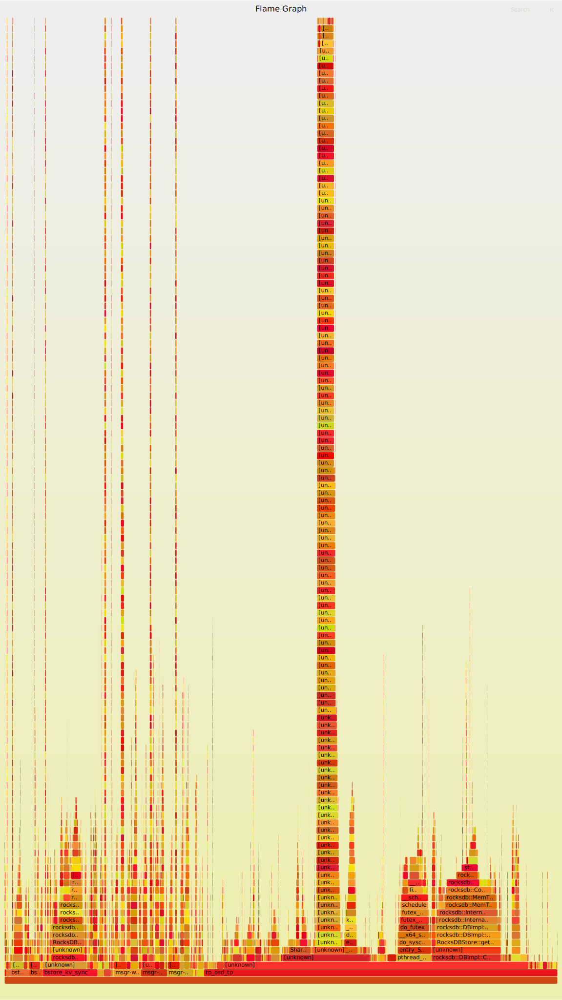

# Tuning

Výkonové optimalizace systémů a NVME Cephu. Měření výkonu hardware, a jednotlivých služeb Cephu, stanovení baseline výkonu. Debugging výkonu a limitů Ceph.

## Stanovení baseline výkonu

Pro stanovení výkonu disků použijeme základní baseline test s FIO. Zaměříme se na výkon write operací, s počtem jobů 1 až 16. Stanovení baseline výkonu disků nám umožní porovnat je s výsledným výkonem RBD Cephu, který bude dále limitován díky overheadu software, výpočetnímu výkonu CPU a latenci sítě.

### Disky

Pro stanovení baseline výkonu disků použijeme test s FIO v lokálním systému, kde je disk připojen. Test je destruktivní, je proto nutné použít nevyužitý disk, na kterém nejsou kritická data.

#. Test NVME disku nvme0 pro zápis s 1 jobem

    fio --filename=/dev/nvme0 --direct=1 --fsync=1 --rw=write --bs=4k --numjobs=1 --iodepth=1 --runtime=60 --time_based --group_reporting --name=4k-sync-write-1

Baseline výkon NVME disku v 1 jobu je 40k IOPS

#. Test NVME disku nvme0 pro zápis s 16 joby

    fio --filename=/dev/nvme0 --direct=1 --fsync=1 --rw=write --bs=4k --numjobs=16 --iodepth=1 --runtime=60 --time_based --group_reporting --name=4k-sync-write-1

Baseline výkon NVME disku v 16 jobech je 200k IOPS

### RBD

Pro otestování RBD výkonu na klientském systému můžeme vytvořit a připojit testovací RBD image

#. Vytvoření testovacího RBD image

    rbd create --size 1024 testimage
#. Připojení blokového zařízení myimage na klientský systém

    rbd map --pool rbd testimage --id admin

#. Test RBD image pro zápis s 1 jobem

    fio --filename=/dev/rbd0 --direct=1 --fsync=1 --rw=write --bs=4k --numjobs=1 --iodepth=1 --runtime=60 --time_based --group_reporting --name=4k-sync-write-1

Baseline výkon RBD image v 1 jobu je 5k IOPS

#. Test RBD image rbd0 pro zápis s 16 joby

    fio --filename=/dev/rbd0 --direct=1 --fsync=1 --rw=write --bs=4k --numjobs=16 --iodepth=1 --runtime=60 --time_based --group_reporting --name=4k-sync-write-1

Baseline výkon RBD image v 16 jobech je 75k IOPS

## Optimalizace výkonu

### Nastavení výkonu CPU

Pro nejlepší latenci je nutné nastavit konstantní maximální výkon CPU. Zajistí tak zpracování CEPH požadavků s nejnižší latencí, a dosáhneme tak vyššího výkonu IOPS 

#### Nastavení hardware v BIOS

#. Povolení všech jader

    Advanced >> CPU Configuration >> Core enabled >> “0”

#. Nastavení power managementu

    Advanced >> CPU Configuration >> Advanced Power Management

Následující musí být nastaveno

    Power Technology >> Custom
    Energy performance Tuning >> disable
    Energy performance BIAS setting >> performance
    Energy efficient turbo >> disable

#. Nastavení pokročilého power managementu

    Advanced >> CPU Configuration >> Advanced Power Management >> CPU P state control

Následující musí být nastaveno

    EIST (P-States) >> Enable
    Turbo mode >> enable
    P-state coordination >> HW_ALL

#. Nastavení CX stavů CPU

    Advanced >> CPU Configuration >> Advanced Power Management >> CPU C state control
    
Následující musí být nastaveno

    Package C-state limit >> C0/C1 state
    CPU C3 Report >>disable
    CPU C6 report >> enable
    Enhanced Halt state >> disable

Po aplikaci a novém rebootu je BIOS hardware nastaven pro maximální výkon CPU

#### Nastavení governoru performance

Systém Linux je dálen nutné nastavit pro governor performance

#. Jednorázové nastavení governoru performance

    apt install linux-tools-common linux-tools-5.13.cpupower frequency-info
    cpupower frequency-set -g performance

#. Nastavení governoru performance po rebootu v /etc/rc.local

    cpupower frequency-set -g performance

### Kernel parametry

#. Nastavení pro optimální výkon a propustnost v ``/etc/sysctl.conf``. Nastavení je třeba projít a zkontrolovat, že nebudou v konfliktu s ostatními službami, pokud jde o sdílený systém.

    fs.aio-max-nr = 1048576
    fs.file-max = 26234859
    kernel.core_uses_pid = 1
    kernel.msgmax = 65536
    kernel.msgmnb = 65536
    kernel.msgmni = 32000
    kernel.pid_max = 4194303
    kernel.sem = 32000 1024000000 500 32000
    kernel.shmall = 18446744073692774399
    kernel.shmmax = 18446744073692774399
    kernel.shmmni = 4096
    kernel.sysrq = 0
    net.bridge.bridge-nf-call-arptables = 0
    net.bridge.bridge-nf-call-ip6tables = 0
    net.bridge.bridge-nf-call-iptables = 0
    net.core.netdev_max_backlog = 65536
    net.core.rmem_max = 268435456
    net.core.somaxconn = 40000
    net.core.wmem_max = 268435456
    net.ipv4.conf.all.accept_redirects = 0
    net.ipv4.conf.all.accept_source_route = 0
    net.ipv4.conf.all.rp_filter = 0
    net.ipv4.conf.all.send_redirects = 0
    net.ipv4.conf.default.accept_source_route = 0
    net.ipv4.conf.default.rp_filter = 0
    net.ipv4.ip_forward = 0
    net.ipv4.ip_local_port_range = 10000 65000
    net.netfilter.nf_conntrack_max = 2621440
    net.netfilter.nf_conntrack_tcp_timeout_established = 1800
    vm.min_free_kbytes = 128000
    vm.swappiness = 0
    vm.zone_reclaim_mode = 0

### IPtables

Pro nejniží latenci zablokujeme nepotřebné moduly iptables, například notorický conntrack který zvyšuje síťovou latenci. Nastavení omezuje funkce iptables a znemožňuje provoz kontejnerů, je třeba použít jen v případě manuální instalace cephu která není v kontejnerech

#. Zákaz conntrack kernelových modulů v ``/etc/modprobe.d/blacklist-conntrack.conf``

    blacklist nf_conntrack_ipv4
    install nf_conntrack_ipv4 /bin/false
    blacklist nf_defrag_ipv4
    install nf_defrag_ipv4 /bin/false
    blacklist nf_conntrack
    install nf_conntrack /bin/false
    blacklist x_tables
    install x_tables /bin/false
    blacklist xt_comment
    install xt_comment /bin/false
    blacklist xt_conntrack
    install xt_conntrack /bin/false
    blacklist ip6_tables
    install ip6_tables /bin/false
    blacklist ip6table_filter
    install ip6table_filter /bin/false
    blacklist ip_tables
    install ip_tables /bin/false
    blacklist iptable_filter
    install iptable_filter /bin/false

Po nastavení je třeba provést reboot systému.

## Debugging výkonu

### perf

Pro zjištění výkonu jednotlivých komponentů ceph a dalších procesů můžeme použít balík perf. Umožní nám vytvoření grafů s časovou osou, kde je stráveno nejvíce času zpracováním systémových volání, můžeme tak zjistit na co proces čeká a kde hledat optimalizaci výkonu

#. Zjištení PID sledovaného procesu

    ps -Af | grep osd

    ceph        1611       1  2 Feb09 ?        16:25:02 /usr/bin/ceph-osd -f --cluster ceph --id 1 --setuser ceph --setgroup ceph

#. Spuštění perf

    perf record -F 299 -p 1611 -g -- sleep 300

#. Vizualizace dat perf

